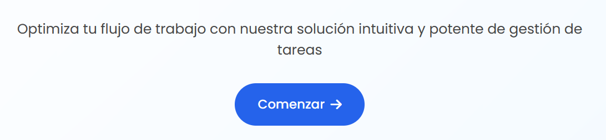
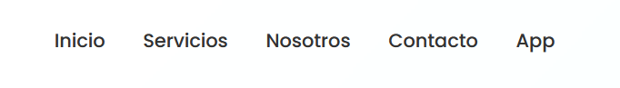
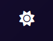
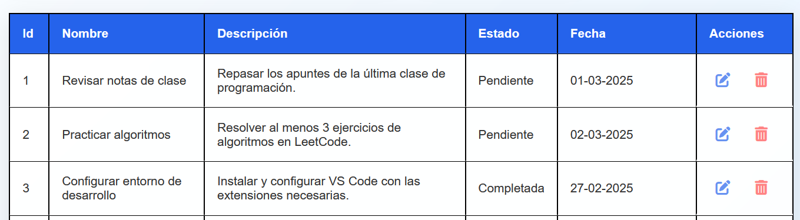
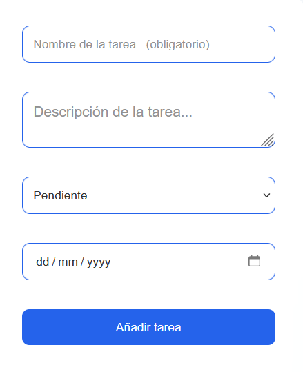
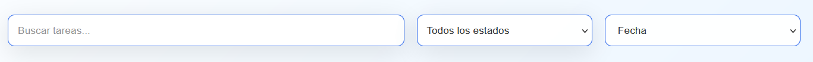
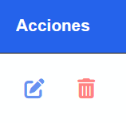
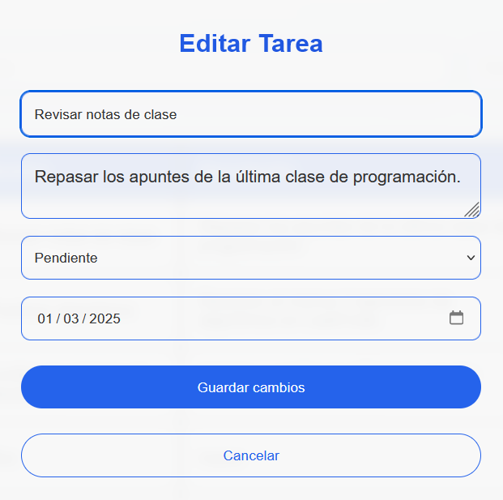
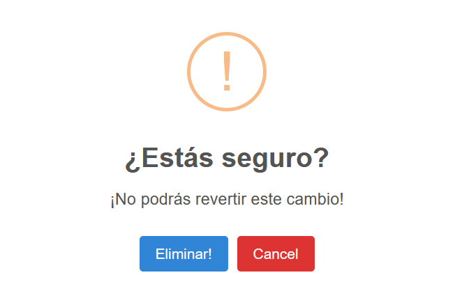

<a id="readme-top"></a>
<!-- PROJECT LOGO -->
<br />
<div align="center">
  <a href="https://github.com/adridonha/Gestor-Tareas">
    
  </a>

  <!--<h3 align="center">TaskMaster Pro</h3>-->

  <p align="center">
    Gestiona tus Tareas como Nunca Antes
  </p>
</div>
<!-- TABLE OF CONTENTS -->
<details>
  <summary>Tabla de contenidos</summary>
  <ol>
    <li>
      <a href="#sobre-el-proyecto">Sobre el proyecto</a>
      <ul>
        <li><a href="#desarrollado-con">Desarrollado con</a></li>
      </ul>
    </li>
    <li>
      <a href="#comenzar-a-usar">Comenzar a usar</a>
      <ul>
        <li><a href="#prerequisitos">Prerequisitos</a></li>
        <li><a href="#instalacion">Instalación</a></li>
      </ul>
    </li>
    <li><a href="#uso">Uso</a></li>
    <li><a href="#nosotros">Nosotros</a></li>
    <!--<li><a href="#license">License</a></li>-->
    <!--<li><a href="#contact">Contact</a></li>-->
  </ol>
</details>


<!-- ABOUT THE PROJECT -->
## Sobre el proyecto

[![Product Name Screen Shot][product-screenshot]](https://github.com/adridonha/Gestor-Tareas)

Hay muchos gestores de tareas pero <strong>TaskMaster Pro</strong> destaca por su minimalismo sin renunciar a la potencia.

* Organiza y prioritiza tus tareas de manera eficiente y en tiempo real
* Añade rápidamente tareas para poder seguir con tu agenda
* Busca, filtra y ordena según tus necesidades
* Edita errores o borra tareas que no necesites
* Mantén un historial de tareas para saber en todo momento qué y cuando lo hicistes

<p align="right">(<a href="#readme-top">volver arriba</a>)</p>

### Desarrollado con

* [![Node][Node.js]][Node-url]
* [![Express][Express.js]][Express-url]
* [![PostgreSQL][PostgreSQL.com]][PostgreSQL-url]
* [![HTML][HTML.org]][HTML-url]
* [![CSS][CSS.org]][CSS-url]
* [![Javascript][Javascript.com]][Javascript-url]


<p align="right">(<a href="#readme-top">volver arriba</a>)</p>

<!-- GETTING STARTED -->
## Comenzar a usar

A continuación se detallan los pasos para poder desplegar TaskMaster Pro

### Prerequisitos

Importante: Esta instalación va dirigida a entornos en Windows pero en los mismos enlaces se puede encontrar información para la instalación de los prerequisitos en otros sistemas operativos.
<br />
Para empezar descárgate el fichero [desde nuestro Github](https://github.com/adridonha/Gestor-Tareas/archive/refs/heads/main.zip) y descomprímelo.
<br />
También necesitaras instalar [PostgreSQL](https://www.postgresql.org/download/) y [Node.js](https://nodejs.org/en/download). <strong>Para PostgreSQL se detallan más instrucciones más abajo</strong>.

### Instalacion

1. Una vez que tengas descomprimido el archivo del proyecto sitúalo en la carpeta de tu preferencia teniendo en cuenta que necesitaremos navegar a ella desde la consola.
2. Suponiendo que has instalado Node.js, ahora instalamos PostgreSQL.
   Se deja todo predeterminado excepto la contraseña cuando se requiera, la cual será la de tu preferencia.
3. Ahora configuraremos la base de datos. Para ello nos vamos a la carpeta del proyecto y al archivo <strong>.env</strong> en la raíz de la carpeta principal.
   Debe tener un aspecto como este:
   ```
   DB_HOST=localhost
   DB_USER=dwec
   DB_PASSWORD=dwec
   DB_NAME=dwec
   DB_PORT=5432
   ```
   En nuestro caso hemos nombrado todo <strong>dwec</strong> por la asignatura de este proyecto. Cambia DB_USER al nombre de usuario que prefieras, DB_PASSWORD al password que usará este usuario y DB_NAME al nombre de la base de datos sobre la que trabajaremos. Nos referiremos a estos campos más adelante.
4. Pulsa la tecla Windows y escribe "psql" para poder usar la consola de PostgreSQL.
   Pulsa intro para usar los parámetros predeterminados hasta que te pida una contraseña, la cual especificamos durante la instalación de PostgreSQL.
   Una vez dentro continuamos con el siguiente paso.
5. Escribimos el siguiente código en la consola para crear el usuario sustituyendo <italic>usuario</italic> por el usuario especificado en DB_USER y <italic>'contrasena'</italic> por el DB_PASSWORD
   ```sql
    CREATE USER usuario WITH PASSWORD 'contrasena';
   ```
6. Ahora creamos la base de datos sustituyendo <italic>basedatos</italic> por lo especificado en DB_NAME
   ```sql
   CREATE DATABASE basedatos;
   ```
   Después nos movemos a la nueva base de datos creada con
   ```sql
   \c basedatos
   ```
   siempre especificando tu base de datos
8. Entonces le damos todos los privilegios sobre la base de datos a nuestro usuario
   ```sql
   GRANT ALL PRIVILEGES ON DATABASE basedatos TO usuario;
   ```
   y le damos permisos sobre el esquema public ya que si no no podría modificar la base de datos
   ```sql
   GRANT ALL ON SCHEMA public TO usuario;
   ```
9. Ahora configuramos la codificación para poder insertar carácteres en español
    ```sql
    SET client_encoding TO 'UTF8';
    ```
    De lo contrario nos aparecerían símbolos extraños en lugar de vocales acentuadas, ñ, etc.
10. En el siguiente paso creamos la tabla con la que trabajará nuestra aplicación
    ```sql
    CREATE TABLE tasks (
    task_id SERIAL PRIMARY KEY,
    task_name VARCHAR(255) NOT NULL,
    task_description TEXT,
    task_state VARCHAR(50) NOT NULL,
    task_date DATE);
    ```
11. Con esto estaría terminado, pero al requerírsenos al menos 5 datos de prueba para esta actividad, serían los siguientes
    ```sql
    INSERT INTO tasks (task_name, task_description, task_state, task_date) VALUES
    ('Revisar notas de clase', 'Repasar los apuntes de la última clase de programación.', 'Iniciada', '2025-03-01'),
    ('Practicar algoritmos', 'Resolver al menos 3 ejercicios de algoritmos en LeetCode.', 'Pendiente', '2025-03-02'),
    ('Configurar entorno de desarrollo', 'Instalar y configurar VS Code con las extensiones necesarias.', 'Completada', '2025-02-27'),
    ('Leer documentación', 'Revisar la documentación oficial de PostgreSQL.', 'Retrasada', '2025-03-03'),
    ('Hacer un mini proyecto', 'Desarrollar una pequeña aplicación CRUD en Python.', 'Iniciada', '2025-03-05');
    ```
12. Importante: en caso de que este método no haya funcionado, como método alternativo, al crear el usuario y la base de datos en los pasos 5 y 6 haríamos lo siguiente
    ```sql
    CREATE ROLE dwec WITH LOGIN PASSWORD 'contrasena';
    CREATE DATABASE basedatos OWNER usuario;
    ```
    Este método funciona en sistemas Mac pero el procedimiento anterior está probado en sistema operativo Windows.
13. Si todo ha ido bien hasta ahora, sólo quedaría arrancar el servidor, por lo que abrimos una consola o terminal y navegamos hasta la carpeta raíz de nuestro proyecto.
    Una vez situados allí escribimos
    ```sh
    node ./server/server.js
    ```
    Deberia aparecer algo como lo siguiente:
    ```sh
    Servidor corriendo en http://localhost:3000
    Conectado a PostgreSQL
    ```
    Nota: si quisieramos cambiar el puerto de escucha simplemente iríamos al archivo <strong>server/server.js</strong> y modificaríamos la siguiente línea
    ```js
    const port = 3000;  // Puedes cambiar el puerto si lo deseas
    ```
15. El servidor estaría corriendo en el puerto 3000 por lo que abrimos un navegador y escribimos http://localhost:3000 y debería de aparecernos la página principal de la app.
    ¡Ya estaríamos listos para empezar!

<p align="right">(<a href="#readme-top">volver arriba</a>)</p>


<!-- USAGE EXAMPLES -->
## Uso

* Para poder empezar a usar la aplicación pulsa en el botón <italic>Comenzar</italic>.<br/><br/>

O si lo prefieres, en la barra de navegación, en <italic>App</italic>.<br/><br/>


* Modo claro / oscuro <br/>
  Pulsa sobre el símbolo del sol / luna en la esquina superior derecha para alternar los modos
  <br/><br/>
  
  

* Vista de tareas<br/>
  A la derecha podremos ver una tabla con las tareas guardadas en la aplicación. Dichas tareas tendrán un ID único de tarea, un nombre para la tarea, una descripción de qué se debe cumplir, un estado que puede ser "pendiente", "iniciada", "completada" y "retrasada", una fecha en la que debe completarse y un campo de acciones con el que se puede editar o borrar cada una de las tareas.
  <br/><br/>
  

* Agregar una tarea<br/>
  Para agregar una tarea a la lista sólo tenemos que rellenar el formulario en el lado izquierdo de la pantalla. El nombre y el estado son obligatorios mientras que los demás campos son opcionales.
  <br/><br/>
  

* Buscar y filtrar<br/>
  Se puede buscar en la lista de tareas por su nombre escribiéndolo en el cuadro de texto para esa finalidad. También se puede filtrar por estado y ordenar por fecha de mas antiguo a más reciente o viceversa. Estos filtros se pueden usar tanto individualmente como simultáneamente.
  <br/><br/>
  

* Acciones<br/>
  Las tareas guardadas se pueden tanto editar como borrar pulsando los iconos correspondientes en el campo <italic>Acciones</italic>
  <br/><br/>
  <br/>
  A continuación se detallan cada una de ellas.
  
* Editar<br/>
  Al pulsar sobre el icono del lápiz podremos editar la tarea. Podremos cambiar lo que queramos aunque los campos nombre y estado seguirán siendo obligatorios.
  <br/><br/>
  

* Borrar<br/>
  Al pulsar sobre el icono del cubo de basura podremos borrar la tarea. Antes de proceder se nos preguntará si estamos seguros de borrarla. En caso afirmativo, la tarea se borrará.
  <br/><br/>
  

* Con esto podemos realizar todas las funciones disponibles actualmente en la aplicación.
  
<p align="right">(<a href="#readme-top">volver arriba</a>)</p>


<!-- TEAM -->
## Nosotros

Agradecer el gran trabajo del equipo que ha hecho posible el proyecto en tan poco tiempo, algunos, como quien escribe estas líneas, cambiando horas de sueños por escribir código, no pudiendo disfrutar totalmente de este último puente antes de las prácticas o incluso uno de los miembros estar recuperándose de cirugía. Ten eso en cuenta Javier 😉
<br/><br/>
Adrián Doña => https://github.com/adridonha <br/>
Álvaro Trigueros => https://github.com/alvarotrig <br/>
Daniel Domínguez => https://github.com/daniel423615 <br/>
José Enrique Mateo => https://github.com/jemmCodeDev


<p align="right">(<a href="#readme-top">volver arriba</a>)</p>


<!-- LICENSE -->
<!-- ## License

Distributed under the Unlicense License. See `LICENSE.txt` for more information.

<p align="right">(<a href="#readme-top">back to top</a>)</p>-->

<!-- CONTACT -->
<!--## Contact

Your Name - [@your_twitter](https://twitter.com/your_username) - email@example.com

Project Link: [https://github.com/your_username/repo_name](https://github.com/your_username/repo_name)

<p align="right">(<a href="#readme-top">back to top</a>)</p>-->


<!-- MARKDOWN LINKS & IMAGES -->
<!-- https://www.markdownguide.org/basic-syntax/#reference-style-links -->
[product-screenshot]: images/producto.png
[Node.js]: https://img.shields.io/badge/node.js-5FA04E?style=for-the-badge&logo=nodedotjs&logoColor=white
[Node-url]: https://nodejs.org/
[Express.js]: https://img.shields.io/badge/express-000000?style=for-the-badge&logo=express&logoColor=white
[Express-url]: https://expressjs.com/
[CSS.org]: https://img.shields.io/badge/css-663399?style=for-the-badge&logo=css
[CSS-url]: https://www.w3.org/Style/CSS/
[HTML.org]: https://img.shields.io/badge/html-E34F26?style=for-the-badge&logo=html5&logoColor=white
[HTML-url]: https://whatwg.org/
[Javascript.com]: https://img.shields.io/badge/javascript-F7DF1E?style=for-the-badge&logo=javascript&logoColor=black
[Javascript-url]: https://www.javascript.com/
[PostgreSQL.com]: https://img.shields.io/badge/postgresql-4169E1?style=for-the-badge&logo=postgresql&logoColor=white
[PostgreSQL-url]: https://www.postgresql.org/
